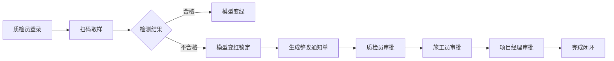
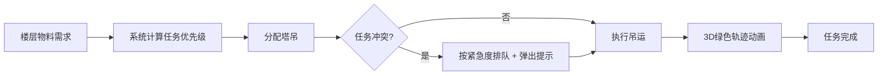

## 1. 产品概述

3D智慧建筑工地物料调度与质量追溯可视化平台，通过三维可视化技术实现建筑工地物料全生命周期管理。覆盖材料堆放区、加工棚、塔吊、楼层作业面和项目部五大核心区域，实现物料从进场、存储、调度、使用到质量追溯的闭环管理。

- **目标用户**：施工员、质检员、项目经理、公司领导
- **核心价值**：提升物料调度效率、降低质量风险、实现全流程可追溯

## 2. 核心功能

### 2.1 用户角色

| 角色 | 登录方式 | 核心权限 |
|------|----------|----------|
| 施工员 | 人脸识别 | 查看物料库存、接收吊运任务、执行整改 |
| 质检员 | 人脸识别 | 扫码取样、质量检测、发起整改通知、审批一级 |
| 项目经理 | 人脸识别 | 审批二级、查看日报、调度审批 |
| 公司领导 | 人脸识别 | 审批三级、全局视图、报表导出 |

### 2.2 功能模块

1. **登录页面**：人脸识别登录模拟、角色选择、操作日志记录
2. **3D主场景**：建筑工地全景漫游、五大区域可视化展示
3. **物料管理**：物料堆模型展示、消耗曲线、供应商档案
4. **质检追溯**：扫码取样、质量状态变更、三级审批流程
5. **库存采购**：未来7天需求预测、安全阈值预警、采购申请流转
6. **塔吊调度**：自动分配任务、绿色吊运轨迹动画、冲突排队
7. **日报系统**：每2小时自动汇总、物料日报生成与推送
8. **报表导出**：按日期导出Excel收发存报表、合格率统计

### 2.3 页面详情

| 页面名称 | 模块名称 | 功能描述 |
|----------|----------|----------|
| 登录页面 | 人脸识别模块 | 模拟人脸扫描、角色选择、错误提示 |
| 3D主场景 | 场景漫游 | 建筑工地3D可视化、视角切换、区域导航 |
| 3D主场景 | 物料堆展示 | 品种/批次/日期/库存/质检状态展示、点击交互 |
| 物料详情 | 消耗曲线 | 近24小时消耗图表展示 |
| 物料详情 | 供应商档案 | 供应商资质、历史合作记录 |
| 质检面板 | 扫码取样 | 模拟扫码、录入检测结果 |
| 审批中心 | 三级审批 | 整改通知/采购申请的多级审批流 |
| 塔吊面板 | 任务调度 | 任务列表、轨迹动画、冲突提示 |
| 日报中心 | 日报推送 | 各区域消耗汇总、消息通知 |
| 报表中心 | Excel导出 | 收发存报表、批次合格率、消耗统计 |

## 3. 核心流程

### 3.1 质量检测与审批流程

用户登录后，质检员扫描物料二维码取样，检测合格则物料模型变绿，不合格则变红并锁定禁止使用，同时自动生成整改通知单。整改单需经质检员→施工员→项目经理三级审批后方可完成闭环。

### 3.2 塔吊调度流程

系统根据各楼层物料需求自动分配吊运任务，在3D场景中用绿色轨迹动画展示吊运路径。多任务冲突时按紧急程度排队并弹出提示，用户可手动调整优先级。

## 4. 用户界面设计

### 4.1 设计风格

- **主色调**：工业深蓝 `#0A1628` 搭配警示橙 `#FF6B35` 和质检绿 `#00C48C`
- **辅助色**：警告黄 `#FFB020`、危险红 `#FF4757`
- **视觉风格**：赛博工业风、深色科技感、霓虹光效、数据仪表盘
- **字体**：标题使用Orbitron科技感字体，正文使用Roboto Mono等宽字体
- **布局**：全屏3D场景 + 左右浮动控制面板 + 底部状态条
- **图标风格**：Lucide线性图标 + 自定义霓虹发光效果

### 4.2 页面设计概览

| 页面名称 | 模块名称 | UI元素 |
|----------|----------|----------|
| 登录页面 | 人脸识别 | 圆形扫描框、扫描线动画、角色卡片、发光按钮 |
| 3D主场景 | 场景面板 | 左侧导航栏、右侧信息面板、底部状态栏、顶部标题栏 |
| 物料详情 | 数据面板 | 玻璃拟态卡片、曲线图、数据指标卡、发光边框 |
| 审批中心 | 审批列表 | 时间线样式、状态徽章、审批按钮、流程节点 |
| 塔吊面板 | 调度界面 | 任务队列卡片、优先级标签、冲突警告条 |
| 报表中心 | 导出界面 | 日期选择器、数据表格预览、下载按钮 |

### 4.3 响应式设计

- 桌面端优先设计（1920×1080及以上）
- 平板端适配：面板可折叠、3D场景自适应
- 触控优化：大尺寸交互按钮、手势缩放支持

### 4.4 3D场景设计

- **环境**：夜间工业场景、蓝色天空盒、地面网格、雾效
- **灯光**：方向光模拟月光、点光源模拟塔吊灯、区域光照明加工棚
- **相机**：OrbitControls轨道控制、预设视角（俯视/正视/第一人称）
- **交互**：hover高亮、点击选中、双击聚焦、拖拽旋转
- **动画**：塔吊摆动、物料消耗动画、吊运轨迹流光、状态呼吸灯
- **后处理**：Bloom发光效果、SSAO环境光遮蔽、ToneMapping色调映射
