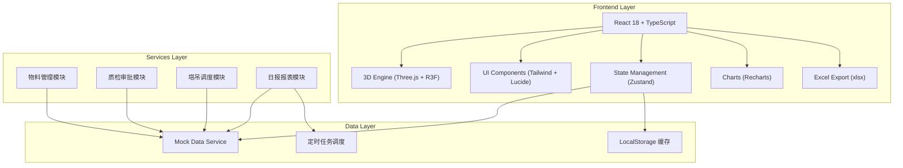

## 1. 架构设计



## 2. 技术描述

- **前端框架**: React@18 + TypeScript
- **构建工具**: Vite
- **3D引擎**: three@0.160.0 + @react-three/fiber@8.15.16 + @react-three/drei@9.99.0
- **后处理效果**: @react-three/postprocessing@2.16.2
- **状态管理**: zustand@4.5.0
- **样式框架**: tailwindcss@3
- **图标库**: lucide-react@0.400.0
- **图表库**: recharts@2.12.7
- **Excel导出**: xlsx@0.18.5
- **后端**: 无后端，纯前端mock数据
- **数据存储**: LocalStorage + In-memory模拟后端

## 3. 路由定义

| 路由 | 页面组件 | 用途 |
|------|-----------|------|
| /login | Login | 人脸识别登录页面 |
| /dashboard | Dashboard | 3D主场景与所有功能面板 |

## 4. 数据模型

### 4.1 类型定义

```typescript
// 用户角色
type UserRole = 'worker' | 'inspector' | 'manager' | 'director';

// 用户信息
interface User {
  id: string;
  name: string;
  role: UserRole;
  avatar?: string;
}

// 质检状态
type QualityStatus = 'green' | 'yellow' | 'red';

// 物料信息
interface Material {
  id: string;
  name: string;
  category: string;
  batch: string;
  arrivalDate: string;
  stock: number;
  safetyThreshold: number;
  qualityStatus: QualityStatus;
  supplierId: string;
  position: { x: number; y: number; z: number };
  zone: string;
  isLocked: boolean;
}

// 供应商
interface Supplier {
  id: string;
  name: string;
  contact: string;
  phone: string;
  qualification: string[];
  rating: number;
}

// 小时消耗量
interface ConsumptionHourly {
  materialId: string;
  hour: number;
  amount: number;
}

// 检测记录
interface Inspection {
  id: string;
  materialId: string;
  inspectorId: string;
  result: 'pass' | 'fail';
  remark: string;
  timestamp: string;
}

// 整改通知单
interface Rectification {
  id: string;
  materialId: string;
  description: string;
  status: 'pending_inspector' | 'pending_worker' | 'pending_manager' | 'completed' | 'rejected';
  approvals: { role: UserRole; userId: string; time: string; comment: string }[];
  createdAt: string;
}

// 采购申请
interface PurchaseRequest {
  id: string;
  materialId: string;
  quantity: number;
  reason: string;
  status: 'pending' | 'approved' | 'rejected';
  requesterId: string;
  approvals: { role: UserRole; userId: string; time: string }[];
  createdAt: string;
}

// 塔吊任务
interface CraneTask {
  id: string;
  craneId: string;
  materialId: string;
  fromZone: string;
  toZone: string;
  priority: 'low' | 'normal' | 'high' | 'urgent';
  status: 'queued' | 'executing' | 'completed';
  path: { x: number; y: number; z: number }[];
  estimatedTime: number;
}

// 日报
interface DailyReport {
  id: string;
  date: string;
  zoneConsumptions: { zone: string; materials: { materialId: string; amount: number }[] }[];
  generatedAt: string;
}

// 操作日志
interface OperationLog {
  id: string;
  userId: string;
  action: string;
  timestamp: string;
  details: string;
}
```

### 4.2 状态管理结构

```typescript
// Zustand Store 结构
interface AppState {
  // 用户状态
  currentUser: User | null;
  isLoggedIn: boolean;
  
  // 物料管理
  materials: Material[];
  suppliers: Supplier[];
  consumptionData: ConsumptionHourly[];
  
  // 质检审批
  inspections: Inspection[];
  rectifications: Rectification[];
  purchaseRequests: PurchaseRequest[];
  
  // 塔吊调度
  craneTasks: CraneTask[];
  
  // 报表中心
  dailyReports: DailyReport[];
  operationLogs: OperationLog[];
  
  // UI状态
  selectedMaterialId: string | null;
  activePanel: 'materials' | 'inspection' | 'crane' | 'reports' | null;
  
  // Actions
  login: (role: UserRole) => void;
  logout: () => void;
  selectMaterial: (id: string | null) => void;
  setActivePanel: (panel: AppState['activePanel']) => void;
  inspectMaterial: (materialId: string, result: 'pass' | 'fail', inspectorId: string) => void;
  approveRectification: (id: string, role: UserRole, comment: string) => void;
  createPurchaseRequest: (materialId: string, quantity: number, reason: string) => void;
  approvePurchase: (id: string) => void;
  assignCraneTask: (task: CraneTask) => void;
  generateDailyReport: () => void;
  exportExcel: (date: string) => Blob;
}
```

## 5. 项目目录结构

```
src/
├── components/
│   ├── login/
│   │   ├── FaceScanner.tsx        # 人脸识别扫描组件
│   │   └── RoleSelector.tsx       # 角色选择组件
│   ├── scene3d/
│   │   ├── Scene3d.tsx           # 3D主场景
│   │   ├── Building.tsx           # 建筑楼层模型
│   │   ├── MaterialStack.tsx      # 物料堆模型
│   │   ├── Crane.tsx              # 塔吊模型
│   │   ├── ProcessingShed.tsx          # 加工棚模型
│   │   ├── ProjectOffice.tsx        # 项目部模型
│   │   ├── CranePath.tsx          # 塔吊吊运轨迹
│   │   └── Ground.tsx             # 地面与环境
│   ├── panels/
│   │   ├── TopBar.tsx             # 顶部标题栏
│   │   ├── SideNav.tsx              # 左侧导航
│   │   ├── StatusBar.tsx             # 底部状态栏
│   │   ├── MaterialDetail.tsx         # 物料详情面板
│   │   ├── InspectionPanel.tsx      # 质检面板
│   │   ├── RectificationPanel.tsx  # 整改审批面板
│   │   ├── CranePanel.tsx           # 塔吊调度面板
│   │   ├── PurchasePanel.tsx        # 采购申请面板
│   │   ├── ReportPanel.tsx          # 报表导出面板
│   │   └── NotificationPanel.tsx      # 日报通知面板
│   │   └── ErrorModal.tsx         # 错误提示弹窗
│   ├── common/
│   │   ├── GlowCard.tsx            # 发光卡片组件
│   │   ├── StatusBadge.tsx           # 状态徽章
│   │   ├── DataChart.tsx            # 数据图表组件
│   │   └── TimelineApproval.tsx     # 审批时间线
├── store/
│   └── useAppStore.ts              # Zustand 状态管理
├── data/
│   └── mockData.ts                  # Mock 数据
├── types/
│   └── index.ts                     # TypeScript 类型定义
├── utils/
│   ├── excelExport.ts                # Excel导出工具
│   └── helpers.ts                   # 辅助函数
├── pages/
│   ├── Login.tsx                      # 登录页面
│   └── Dashboard.tsx                 # 主仪表盘页面
├── App.tsx
├── main.tsx
└── index.css
```
